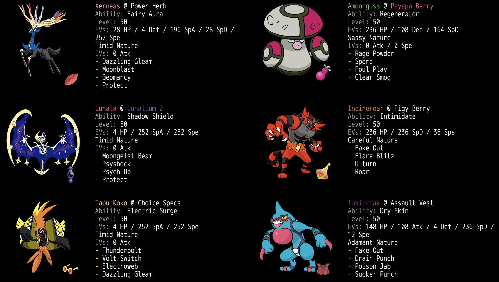

# 【VGC2019MoonSeries/Zelda's Challenge使用構築】Zルナアーラ＋ゼルネアス

|ポケモン|技1|技2|技3|技4|持ち物|
|:----|:----|:----|:----|:----|:----|
|ルナアーラ|シャドーレイ|サイコショック|自己暗示|守る|ルナアーラZ|
|ゼルネアス|ムーンフォース|マジカルシャイン|ジオコントロール|守る|パワフルハーブ|
|カプ・コケコ|10万ボルト|マジカルシャイン|ボルトチェンジ|エレキネット|拘り眼鏡|
|ドクロッグ|猫騙し|ドレインパンチ|毒突き|不意打ち|突撃チョッキ|
|ガオガエン|猫騙し|フレアドライブ|蜻蛉返り|吠える|フィラの実|
|モロバレル|怒りの粉|キノコの胞子|クリアスモッグ|イカサマ|ウタンの実|



12月の仲間大会と、12月30日に開催されたZelda's Challenge（参加費$10の海外マネーマッチ）で使った構築です。
## 目次

- [構築経緯](#構築経緯)
- [個別解説](#個別解説)
- [Zelda's Challenge簡易レポート＆Replay](#zeldas-challenge簡易レポートreplay)
- [QRレンタルチーム](#QRレンタルチーム)
- [Showdown Text](#showdown-text)

仲間大会のリプレイはYouTubeに[ライブ履歴](https://www.youtube.com/playlist?list=PLcSdQQfP_Yk1EOTp3Xfv63lTtZ3qXWXXG)が残っているので、良かったらそちらも見てください。

## 構築経緯

ムーンシリーズではZ技が使えるということで、強力な専用Z技を持つルナアーラの使用感を確かめようと思いZ持ちのルナアーラからスタート。

ルナアーラを使う上で障壁となるのが相手のイベルタルとルナアーラミラーであるため、イベルタルに圧倒的に強いゼルネアスとカプ・コケコを組ませるところまではすぐに決まりました。ルナアーラミラーに強くするためにルナアーラは臆病最速とし、ゴースト技を指で吸って無効にできゼルネアスとの相性も良いドーブルを4体目に採用しました。

ここまでで相手のスカーフカイオーガに対して薄いためドクロッグを採用。ルンパッパを採用すると構築全体が毒技とカミツルギに弱くなりすぎるため不採用としました。

最後に立ち回りの幅を広げるために威嚇持ちのガオガエンを採用して6体の並びが決まりましたが、ドーブルはうまく扱えなかったので最終的にモロバレルになりました。

環境初期ということで、わかりやすく強いZ技を持つルナアーラと、そのルナアーラに強いイベルタルが多くなると予想して、それらを主に意識した構成となっています。

## 個別解説

### ルナアーラ

```
臆病 213(4)-*-109-189(252)-127-163(252)
シャドーレイ、サイコショック、自己暗示、守る＠ルナアーラZ
```

構築のスタートとなったポケモンです。ルナアーラZの威力は200で、ギルガルドのゴーストZ＋α程度の火力が出ると考えると強さがわかりやすいかと思います。相手のトリックルーム始動要因の大半に強く、トリックルームを苦手とするゼルネアスとの相性は良いと思いました。

今回はゼルネアスと組ませるということで自己暗示を採用してみましたが、ゼルネアス以外と組ませる場合には追い風やトリックルームを採用してS操作要因として運用することになるかと思います。

自己暗示を採用するメリットとしては、味方に暗示することがわかりやすい勝ちパターンになることと、相手の積んだゼルネアスに対して猫＋暗示で切り返せることだと思いますが、味方に暗示が決まることはなかなかないこともあって正直微妙でした。ゼルネアスと組ませる場合であっても、カミツルギやカプテテフ等のアタッカー寄りの駒を投入して追い風を採用する方が強いかもしれません。

配分については前述の通りミラーで上からZを叩き込むために臆病最速とし、特性のおかげで一撃で倒されることがほぼないので耐久調整せずにCSに振り切りました。

### ゼルネアス

```
臆病 205(28)-*-116(4)-176(196)-122(28)-166(252)
ムーンフォース、マジカルシャイン、ジオコントロール、守る＠パワフルハーブ
```
- C222ダブル雨潮吹き耐え

相手のイベルタルを牽制してルナアーラを動かしやすくしつつ、ジオコンを積んで勝ち筋となることを目指します。

特筆すべき点はありませんが、最速にすると相手のカイオーガやカプテテフのスカーフ判定ができるのが便利だと個人的に感じています。

### カプ・コケコ

```
臆病 146(4)-*-105-147(252)-95-200(252)
10万ボルト、マジカルシャイン、ボルトチェンジ、エレキネット＠拘り眼鏡
```

ゼルネアスと同じく相手のイベルタルに強いことが主な採用理由です。サンシリーズに比べるとデンキZの存在により相手にかける圧力が大きくなっています。

ルナゼルネの組み合わせは相手のガオガエンが重いため、削るために拘り眼鏡で採用しました。ゼルネアスと並べるとマジカルシャインもなかなかの火力が出ます。チョッキや襷を持たない分スカーフカイオーガには弱くなっているため、後述のドクロッグでカバーします。

### ドクロッグ

```
意地っ張り 177(148)-154(108)-86(4)-*-115(236)-107(12)
猫騙し、ドレインパンチ、毒突き、不意打ち＠突撃チョッキ
```
- H16n+1
- A11n、毒突きで156-91ルンパッパを最低乱数以外1発
- C183ゼルネアスのジオコンムンフォ最高乱数以外耐え

カイオーガ入りにしかほぼ出しません。配分はワイルドさんの質問箱にあったものを拝借しました。

ゼルネアス、カイオーガ、カプ・コケコあたりの相手をしてほしいため突撃チョッキでの採用。伝説枠が不利を取るカミツルギに対して打点がないと困るため格闘技はけたぐりではなくドレインパンチを採用し、ルナアーラ＋カイオーガに対して選出した場合にドクロッグでルナアーラを倒せると強いと考えて最後の枠には不意打ちを採用しました。

### ガオガエン

```
慎重 200(236)-135-110-*-154(236)-85(36)
猫騙し、フレアドライブ、蜻蛉返り、吠える＠フィラの実
```
- H4n
- C183ゼルネアスのジオコンムンフォ確定耐え

ツンデツンデ入りに対してドクロッグを出さなければならないのが弱いと感じていたこともあり、トリックルームを阻止できジオコンゼルネにも撃てる吠えるを最後の枠に入れてみました。悪技を切ったことでルナアーラミラーが厳しくなってしまったので、やや失敗だったかもしれません。

### モロバレル

```
生意気 219(236)-*-104(108)-105-133(164)-31
怒りの粉、キノコの胞子、クリアスモッグ、イカサマ＠ウタンの実
```

ガオガエン、モロバレルの枠はイマイチ煮詰めきれなかった部分です。

冒頭でも述べた通りこの枠は初めはドーブルでしたが、選出機会があまりなかったためトリックルームとカイオーガゼルネアスあたりを意識して使い慣れた型のモロバレルに変更しました。

しかし、テテフネクロあたりにはルナアーラが強いためウタンバレル＋ゼルネアスプランを取る必要がなくウタンでの採用は完全に失敗で、ルナアーラミラーも厳しくなってしまったためそもそもここはやはりドーブルが正解だったと思います。

## Zelda's Challenge簡易レポート＆Replay

### R1

相手のPT：カイオーガ、トルネロス、カミツルギ、日食ネクロズマ、ガオガエン、アマージョ

#### [G1](http://replay.pokemonshowdown.com/gen7vgc2019moonseries-842038224)

日食ネクロを考えるとルナアーラを先発に出したいが、トルネオーガに対してそんなに強くないのでとりあえずガエンゼルネ先発。初手から全体的にガエンがかなり刺さっていたので蜻蛉で回しながらガエンで詰めて勝ち。

#### [G2](http://replay.pokemonshowdown.com/gen7vgc2019moonseries-842038429)

さっきの相手の選出がガエンきつかったので今度はトルネオーガが出てくると思い先発にコケコを配置。カイオーガがスカーフではないことがわかったので猫＋10万を押すと通ってそのまま勝ち。

### R2

相手のPT：カイオーガ、イベルタル、ガオガエン、トルネロス、アマージョ、ドクロッグ

#### [G1](http://replay.pokemonshowdown.com/gen7vgc2019moonseries-842049160)

トルネロスを追い風させず処理できたので楽になる。コケコとドクロッグで詰めて勝ち。

#### [G2](http://replay.pokemonshowdown.com/gen7vgc2019moonseries-842049446)

1戦目でカイオーガがスカーフだとわかったが、アマージョ引きを考えると先発にコケコは出せないのでドクロゼルネ続投。

2ターン目、ドクロッグがイベルに引くかなと思いトルネ側にルナZ打つも外して微萎えするも、ジオコン積まずに殴ってイベルタルを処理。その後は相手に守るがほぼなさそうな感じだったため猫＋攻撃で1体ずつ処理して勝ち。

### R3

相手のPT：イベルタル、ガオガエン、ツンデツンデ、グラードン、カプ・コケコ、フシギバナ

#### [G1](https://replay.pokemonshowdown.com/gen7vgc2019moonseries-842061789)

初手でツンデ集中して倒してアドを取るも、2ターン目コケコ落としてもらって猫＋ジオコン展開を狙っていたところ剣舞を積まれて厳しくなってしまう。その後イベルタルを処理してルナアーラを動かそうとするが、グラードンもイベルタルもD固すぎて微妙に倒しきれず、負け。

#### [G2](http://replay.pokemonshowdown.com/gen7vgc2019moonseries-842061901)

イベルタルを前に出してくる感じがなさそうだと思ったためルナ先発。ガエンでトリルを凌ぎ、ツンデツンデを処理して眼鏡シャインの一貫を作って削り切って勝ち。

#### [G3](http://replay.pokemonshowdown.com/gen7vgc2019moonseries-842061993)

ここまで見せていなかったガエンの吠えるでツンデのトリルを止める方針でコケコガエン先発。結果的にツンデが選出されていなかったのでゼルネが通り、断崖も避けて勝ち。

### R4

相手のPT：イベルタル、グラードン、ガオガエン、カプ・コケコ、ツンデツンデ、フシギバナ

#### [G1](https://replay.pokemonshowdown.com/gen7vgc2019moonseries-842074019)

さっきの感覚で出したら先発にイベル出てきてめっちゃきつくなる。2ターン目以降もうまくグラツンデを展開されてボコボコにされて負け。

#### [G2](https://replay.pokemonshowdown.com/gen7vgc2019moonseries-842074106)

ゼルネコケコで押し込める展開に持ち込んだかと思いきや、+2シャインと眼鏡10万をツンデがミリ耐えしてゼルネ倒されて負け。絶対勝てると思ってたので悔しい。

### R5

相手のPT：ゼルネアス、ルナアーラ、ガオガエン、ドーブル、ドクロッグ、クロバット

#### [G1](http://replay.pokemonshowdown.com/gen7vgc2019moonseries-842082644)

回避あげたドーブルがボルチェン避けて萎えるが、そもそもムンフォと蜻蛉をルナアーラ方向に集中しておけば回避できたのでプレミくさい。こっちのゼルネで相手のルナを落としに行くターンにゼルネ同士の同速に負けて暗示を通され絶望。吠えるで全部吹っ飛ばすも相手のガエンが倒せなくなって負け。キーーー！

#### [G2](https://replay.pokemonshowdown.com/gen7vgc2019moonseries-842082806)

コケコのボルチェンからガエンを出してダメージレースで有利を取る。ルナゼルネ同士の対面で両方同速勝って一方的な展開になった。

#### [G3](https://replay.pokemonshowdown.com/gen7vgc2019moonseries-842082896)

指ワイガの択つよドーブルに全部通されて負け。

### R6

相手のPT：イベルタル、グラードン、ガオガエン、カプ・コケコ、ツンデツンデ、フシギバナ

#### [G1](https://replay.pokemonshowdown.com/gen7vgc2019moonseries-842092832)

味方にボルチェンで半分回復発動させるオシャレムーブでルナZ＋蜻蛉の集中耐えられそうなところで急所引いてガエン落ちて有利になり勝ち。

#### [G2](http://replay.pokemonshowdown.com/gen7vgc2019moonseries-842092992)

初手どっちからバクアが来てもきついから蜻蛉してガエン出し直せるようにしたところ相手は両交換だったためアドを取る。その後ツンデをまたしても急所で突破して爆アドを取りそのまま勝ち。

### R7

相手のPT：カイオーガ、ルナアーラ、デンヂムシ、カミツルギ、フェローチェ、カプテテフ

#### [G1](http://replay.pokemonshowdown.com/gen7vgc2019moonseries-842102536)

マジルがちらついてジオコンを押せず弱気に守る胞子を押したところバレルに集中されていて絶望。その後もルナの同速に勝てばワンチャンあったけど勝てなくて負け。

#### [G2](http://replay.pokemonshowdown.com/gen7vgc2019moonseries-842102628)

フェローチェの挑発を考慮できておらずアドを取られ、またしてもルナの同速に負けてしまい非常に厳しい。ラス1テテフなら負けの場面で猫打つも相手のラス1はツルギやったのでギリ生存するがオーガを削りきれず負け。ルナオーガに対してウタンバレル軸でプランを組んだのが失敗でした。

### 結果

[Zelda's Challenge 結果](https://battlefy.com/zelda-challenges/vgc2019-moon-series-rise-of-the-moon-challenge/5bd05449d07d8403d1497251/stage/5c27c4613244a303c6523ab0/results)

5勝2敗以上がトップカットだったためトップカットには進出できず。自分が負けた相手が全員トップカットに進出したということもあり、16位/65人と順位はぼちぼちでした。

このようなマネーマッチに参加するのは初めてでしたが、良い練習になって非常に良かったです。モチベーション維持のためにも仲間大会や海外の大会には積極的に出ていきたいなと思ってます。

## QRレンタルチーム

https://3ds.pokemon-gl.com/rentalteam/usum/BT-4CD2-8EED

## Showdown Text

https://pokepast.es/8838a71cbe8bf277

```
Lunala @ Lunalium Z  
Ability: Shadow Shield  
Level: 50  
EVs: 4 HP / 252 SpA / 252 Spe  
Timid Nature  
IVs: 0 Atk  
- Moongeist Beam  
- Psyshock  
- Psych Up  
- Protect  

Xerneas @ Power Herb  
Ability: Fairy Aura  
Level: 50  
EVs: 28 HP / 4 Def / 196 SpA / 28 SpD / 252 Spe  
Timid Nature  
IVs: 0 Atk  
- Dazzling Gleam  
- Moonblast  
- Geomancy  
- Protect  

Tapu Koko @ Choice Specs  
Ability: Electric Surge  
Level: 50  
EVs: 4 HP / 252 SpA / 252 Spe  
Timid Nature  
IVs: 0 Atk  
- Thunderbolt  
- Volt Switch  
- Electroweb  
- Dazzling Gleam  

Toxicroak @ Assault Vest  
Ability: Dry Skin  
Level: 50  
EVs: 148 HP / 108 Atk / 4 Def / 236 SpD / 12 Spe  
Adamant Nature  
- Fake Out  
- Drain Punch  
- Poison Jab  
- Sucker Punch  

Incineroar @ Figy Berry  
Ability: Intimidate  
Level: 50  
EVs: 236 HP / 236 SpD / 36 Spe  
Careful Nature  
- Fake Out  
- Flare Blitz  
- U-turn  
- Roar  

Amoonguss @ Payapa Berry  
Ability: Regenerator  
Level: 50  
EVs: 236 HP / 108 Def / 164 SpD  
Sassy Nature  
IVs: 0 Atk / 0 Spe  
- Rage Powder  
- Spore  
- Foul Play  
- Clear Smog  
```
