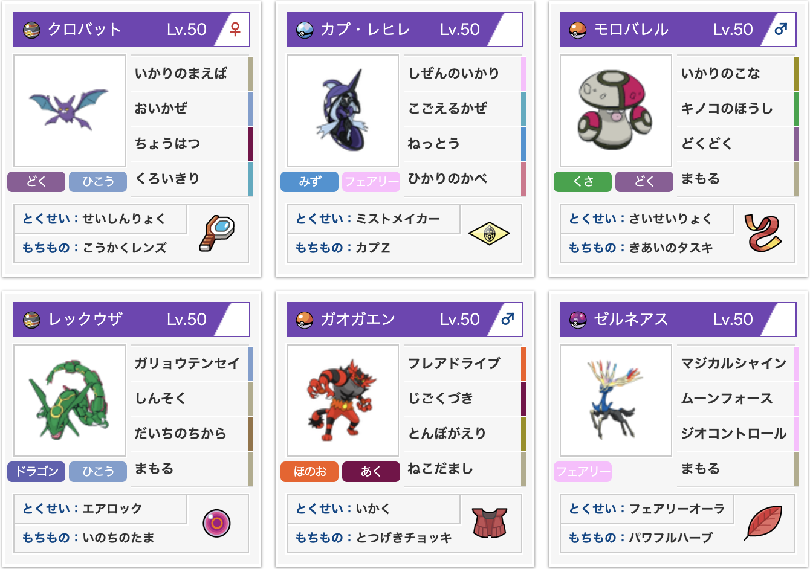
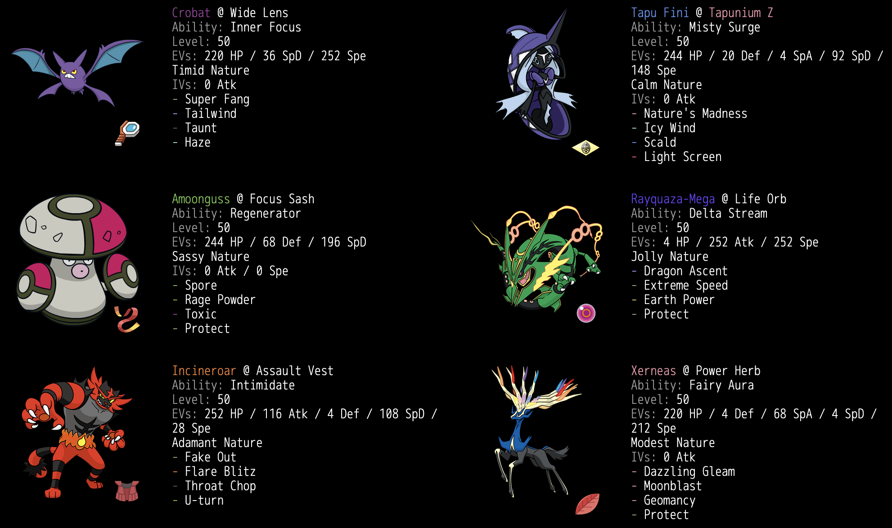

# 【VGC2019UltraSeries/JCS予選1765】怒りのクロバレックゼルネ




[pokepaste](https://pokepast.es/ba2bbbbeb19d0ab1)

JCS予選最高1765、最終1747

Trainer TowerのSpring ScrambleというBO3の大会でも同じ6体の並びを使ってTOP16に入ることができました。こちらの記事も後日Trainer Towerに掲載していただく予定です。

## 目次

- [構築経緯](#構築経緯)
- [個別解説](#個別解説)
- [選出・立ち回り](#選出・立ち回り)
- [QRレンタルチーム](#QRレンタルチーム)
- [総評](#総評)

## 構築経緯

伝説枠の選択において、勝ち筋の組み立て方が明確なゼルネアスを採用することを早い段階で決めました。相性の良いガエンバレルをまず採用した上で、相方の伝説枠にはグラードンとレックウザを試しましたが、相手のグラードンが重いこと、不意のめざ水で初見殺しされるのを嫌ったこと、相手のグラカイに有利を取れることを考慮して最終的にレックウザを選択しました。ガエンバレルゼルネ@1の選出において、メガ枠と伝説枠を同時に食うことで選出のパワーが落ちないのも気に入った点の一つです。

次に、伝説枠の2体が共に不利を取るカプテテフと、重力催眠やドーブルなどを見るためにカプレヒレを5枠目に採用しました。レックゼルネという構築ジャンルにおいて、レヒレガエンの2体はよほどのことがない限り入ってくるのではないかと思います。

ラスト1枠は色々考えましたが、クロバットを試した際に先発クロバレック後発ガエンゼルネの選出に強さを感じたため、6体の並びをここで決めました。具体的に感じた強みとしては、

- ゼルネアスを使う上では、先発からジオコントロールを狙うのではなく、別の駒で荒らしてから試合中盤以降にガエンゼルネを並べて猫ジオコンを狙うことが、①レッドカードや吠えるといったピンポイント対策に引っかかりにくい、②相手の追い風トリルを凌ぎやすい、③予め削りを入れておくと片方をシャインで倒すことができるようになり両縛りの状況を作りやすい、などの点から強いと考えており、先発クロバレックの性能がこの動きにマッチしている。
- こちらのゼルネアスに対して役割を持ち汎用性の高いガオガエンとカプレヒレを、怒りの前歯＋珠ガリョウテンセイの集中で威嚇が入っても倒せる（守る持ちがほぼいない上受けられる駒が限られているので通りやすい）。
- クロバットの挑発と黒い霧が相手の先発ゼルネアス展開を許さないため、こちらが一方的に上から制圧するor相手より先にゼルネアスを立てる展開に持ち込みやすい。

などが挙げられます。クロバットの枠にランドロスが入った形がテンプレになっていたかと思いますが、相手の積んだゼルネアスに対して何もできないことを嫌って採用しませんでした。

Spring Scrambleでこの6体を回している中で、モロバレルがBO1向きではないことがわかりやや不満を感じていたのですが、他に良い駒が浮かばなかったので続投して本番に持ち込みました。

## 個別解説

### クロバット

```
臆病 188(220)-*-100-*-105(36)-200(252)
怒りの前歯、追い風、挑発、黒い霧＠広角レンズ
```
- A232メガレックウザの持ち物補正なしガリョウテンセイを確定耐え(157~186)
- A183ガオガエンの猫騙し＋C222スカーフカイオーガの天候補正なしW潮吹きを90%ぐらいで耐え

主に先発でレックウザと並べて選出し、前歯で削りを入れたり追い風を展開したりして後発のゼルネアスに繋ぎます。

冒頭でも述べた通り、前歯とレックの攻撃を合わせてゼルネアスの障壁となるポケモンを強引に落としに行きます。受けに回ることが基本的にできないこと、主に倒したいガエンレヒレあたりの守るの所持率が低いこと、珠のおかげで威嚇が入ってもそれらを倒せること、倒されても後ろのガエンゼルネに繋ぎやすいことなどが強力でした。

前歯＋レックの攻撃で集中して倒す動きは非常に強力ですが、集中をかけた際に前歯を外してしまうと相手を倒せないだけでなく、耐久が下がり珠ダメの入ったレックウザが返しの攻撃を受けてしまうため負けに直結します。Spring ScrambleではBO3での1回の外しはギリギリ取り返せると考えてカプテテフ入りにも出せるようにウタンを持たせていましたが、外すと負けに直結する命中90%をBO1の主軸に据えることはできないのでJCS予選では広角レンズを持たせました。カプテテフ入りには出せなくなってしまいますが、後述するカプレヒレの単体性能を引き上げることでカプテテフ入りにはカプレヒレを確定選出できるようにして解決を図りました。

技構成は前歯、追い風、挑発までは確定で、ゼルネアスの前で追い風から入るために黒い霧が必要だったのでテンプレに落ち着きました。配分については、クロバットが何もできず倒される可能性のある相手をカプテテフ以外で考えた場合にスカーフカイオーガが挙がったので、そこを意識して少しだけDに寄せました。テテフには出さないので、何もできず倒されるのはコケコ同速負けデンキZぐらいしかないと思っていましたが、JCSではスカーフルナアーラに1回しばかれました。

ところで、この構築の一般ポケモンは全員ピンチベリー持ちではないにも関わらずHPを偶数に設定しています。理由としては、伝説戦においては一般ポケモンの汎用性を底上げする怒りの前歯・自然の怒りを被弾することがそれなりに多く、HP満タンの状態でこれらを受けた際にピンチベリーを持っていないことが相手にバレるデメリットがそこそこ大きいと判断したためです。

### レックウザ

```
陽気 181(4)-232(252)-120-180-120-183(252)
ガリョウテンセイ、神速、大地の力、守る＠命の珠
```
- 威嚇込みのガリョウテンセイで202-135までのガオガエン、177-153までのカプレヒレに50%~

軸となる動きについてはだいたいここまでで書いた通りです。鉢巻画竜点睛耐えのラインを前歯と合わせてほぼぴったり倒すことができるので、耐えられてしまうことはありませんでした。

鉢巻や襷＋剣舞のような型の方がレックウザ単体のパワーは高いと思いますが、この構成だと構築全体でツンデツンデ・ウツロイド・トゲデマルなどが厳しいため、これらをレックウザでカバーできるようにし、最終的にゼルネアスを通しやすくすることを意識して大地の力の採用に至りました。シュカを盾に突っ張ってくるツンデツンデを前歯大地の集中で落としたり、準速鉢巻レックウザの増加を受けてJCSで多く見られたイワZウツロイドを上から葬ったりと、使い所は多かったです。

基本的にゼルネアスの障壁を倒すor削るのに使いますが、グラードン相手にはゼルネアスを通しづらい上にレックウザ単体で詰め筋となるので大切に扱うよう心がけていました。耐久が下がると意外とあっさり倒されてしまうので相手を倒せる時以外は無闇に動かさないことが大事だと思います。

### カプレヒレ

```
穏やか 176(244)-*-138(20)-116(4)-178(92)-124(148)
自然の怒り、凍える風、熱湯、光の壁＠カプZ
```
- 熱湯で175-111ゲンシグラードンを確定(192~228)
- A232メガレックウザの珠ガリョウテンセイを確定耐え(148~175)
- C183ゼルネアスの+2ムーンフォースを確定耐え(145~172)
- 凍える風1回で最速メガレックウザ抜きの素早さ+1

主にカプテテフ入りと、ドーブルやドータクンなど眠りを撒いてくる可能性のある相手に対して選出しました。ドータクンはエスパーZ持ちが多くクロバットの挑発でトリルを止めるプランが通用せず、相手にカプレヒレが同居しているパターンが多くモロバレルも出せないのでドータクン入りにはほとんどカプレヒレを出していました。

凍える風でS操作、自然の怒りで削りをこなすことができるため、クロバットと同じような役割を果たすことができます。先発で出していくことが多いですが、裏投げテテフ＋催眠のような動きがきついので、後発に置くこともそれなりにありました。

Spring Scrambleではピンチベリーで運用していましたが、JCSでは選出した場合の削り役としての性能を向上させるカプZを持たせました。倒しづらそうな相手にとりあえず当てておけば神速で縛れるようになります。外すことがないのも嬉しく、ゼルネアスに対しては黒い霧ガン無視ジオコンor黒い霧警戒攻撃のどちらの動きに対しても裏目がなく使用感はとても良かったです。

技構成については自然の怒りと凍える風がまず確定で、クロバットを出さない場合にグラードンを倒せるポケモンがレックウザだけになってしまうと厳しいのと、カプZで削った相手を自ら倒しきるためにも何らかの攻撃技が欲しく熱湯を採用しました。耐久に振ったグラードンは倒せませんが、神速圏内に入れば問題ないと考えCを上げることはしませんでした。ラスト枠にはカプテテフ軸に強くするために光の壁を採用しましたが、JCSではトリックルーム絡みの重力催眠＋グラードン系統に多くマッチングしたため、トリルターンを稼ぐことができる守るを採用しても良かったかなと思いました。また、同じ理由で素早さを下げるのも選択肢の一つかなと思います。

### ガオガエン

```
意地っ張り 202(252)-165(116)-111(4)-*-124(108)-84(28)
猫騙し、フレアドライブ、地獄突き、蜻蛉返り＠突撃チョッキ
```
- フレアドライブで157-146メガクチートを最低乱数以外1発
- 最遅グラカイ抜かれ、追い風下で最速100族抜き

レックゼルネと合わせて確定選出となる駒です。威嚇猫騙しによるサポートをこなしつつも、自身も鋼や超霊の処理役として攻撃に参加して欲しいことから、ある程度の火力と耐久を両立できる突撃チョッキで採用しました。ピンチベリーを採用しなかったのは主に相手のウルトラネクロズマの大地の力に対して踏ん張る必要があると考えたためです。

悪技はバークアウトも候補に挙がるかと思いますが、この構築においてはカプZと合わせてドータクンやネクロズマを倒したい場面があることから悪タイプの打点が欲しいと考え、DDラリアットと地獄突きを検討しました。メガレックウザの耐久下降を貫通しないことと、相手のガオガエンに対して追加効果が有効となる場面が微チャンありそうと考えて地獄突きを選択しました。

### ゼルネアス

```
控えめ 229(236)-*-116(4)-176(68)-119(4)-146(212)
マジカルシャイン、ムーンフォース、ジオコントロール、守る＠パワフルハーブ
```
- +2ムーンフォースでCSベースのゼルネアスを倒せる程度
- 最速フシギバナ抜き

この構築のエースです。基本的には後発に配置して、先発のポケモンで相手を削ったりS操作した後でガエンゼルネを着地させてジオコントロールをできるだけ少ないリスクで積むことを目指します。対トリックルーム軸など、ガエンバレルで擁護する動きが有効に働きそうな場合のみ先発からジオコントロールを狙います。いずれの展開においても最速を取る必要性が無いため控えめで採用しました。最速にはしていませんが、ある程度のSがあると安心して動かせる場面が増えると考えてSには多めに配分しました。

### モロバレル

```
生意気 220(244)-*-99(68)-*-137(196)-31
怒りの粉、キノコの胞子、どくどく、守る＠気合の襷
```

胞子が通りそうな場合やトリックルーム軸に対して選出する予定でしたが、JCSでマッチングしたトリックルーム軸はカプレヒレと同居していて胞子が通りにくかったり、重力催眠が絡んでいてカプレヒレを優先的に選出したい場面が多く、選出機会はあまりありませんでした。この枠を環境に合わせて組み替えると良い感じになるのではないかと思います。

攻撃技には草結びやクリアスモッグを採用していましたが打ちたい場面が全くなかったので、悩んだ末この枠をヌケニン対策に割くことにしました。結果的に本番では水ヌケニンにはマッチングせず、水浸しのないヌケニンは普通に倒せたのですが、ラッキーとマッチングした際に押す機会があったので間違いではなかったかなと思います（なお負けた）。この枠自体が完全に失敗だったので特に言うことはないです。何か代わりの良い駒を見つけたら教えてください（懇願）。

## 選出・立ち回り

### 基本選出1

先発：クロバット、レックウザ

後発：ガオガエン、ゼルネアス

ゼルネアス入りやトリルのないオーガレックにはだいたいこの選出。先発クロバレックで荒らしてから後発ガエンゼルネを通します。

### 基本選出2

先発：カプレヒレ、ガオガエン

後発：レックウザ、ゼルネアス

カプテテフ入りや催眠系などカプレヒレが必要な場合の選出。レヒレガエンは後発に置いた方が良い場合があるのでその場合は適当に入れ替えます。

### 基本選出3

先発：ガオガエン、ゼルネアス

後発：モロバレル、レックウザ

主に対トリックルーム軸の選出。初手からゼルネアスを立ててガエンバレルで守りきることを目指します。

## QRレンタルチーム

[QRレンタルチーム](https://3ds.pokemon-gl.com/rentalteam/usum/BT-4574-4D09)

## 総評

クロバレックで荒らしてからガエンゼルネを通す動きの軸が強力で、この選出ができた時はそこそこ勝てましたが、テテフが同居している等でレヒレを出した場合に立ち回りで負けてしまったり、JCSで数の多かったルナグラ系統の構築に苦戦しました。全国大会に出場される方は頑張ってください。