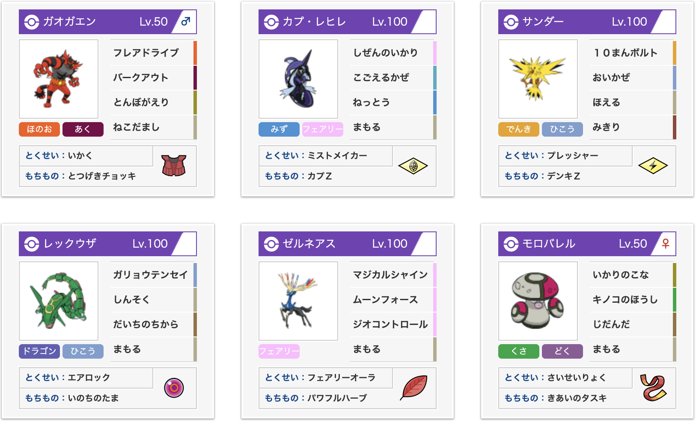
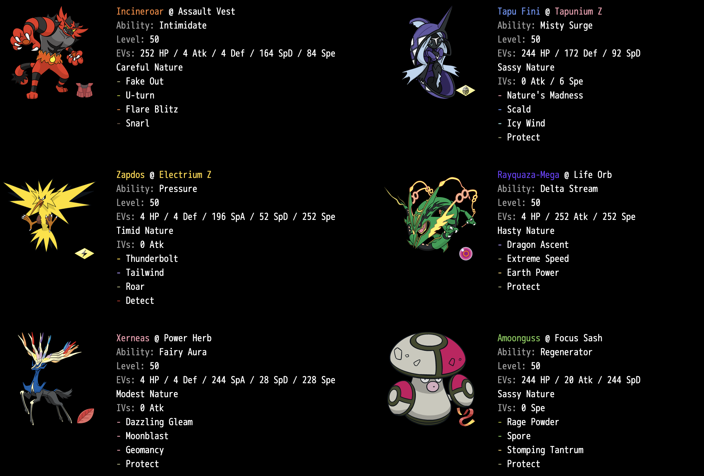

# VGC2019 地団駄バレルレックゼルネ
[English](vgc2019ultra_xray_en.md)





[pokepaste](https://pokepast.es/99b57ed559a77be3)

## 目次
- [構築経緯](#構築経緯)
- [戦績](#戦績)
- [個別解説](#個別解説)
- [総括](#総括)

## 構築経緯
　ムーンルールが終わった頃からレックゼルネガエンバレル@2の並びを使い続けてきました。JCSの予選を抜けることはできませんでしたが、全国大会が終わった頃に再びこの並びを考え直して、@2には以下のような要素が必要であると感じました。

1. 雨下のテッカグヤを処理できる  
→ 電気打点
2. テテフのフィールドを奪う  
→ コケコorレヒレ？
3. グラードンをトリル・非トリル問わず対処できる  
→ 高耐久水タイプ？
4. メガゲンガー・ウツロイドを見れる

　これらを踏まえて考えるうちに@2の並びはコケコスイクンとレヒレサンダーの2つに絞られ、カプではない方でメガゲンガーとウツロイドを見る方針となりました。

　初めに[MisterGXの並び](https://www.trainertower.com/blue-stream-a-spring-scramble-1st-place-team-report/)である前者を試しました。スイクンはバークアウトのおかげでメガゲンガーやウツロイドにも抵抗可能ですが、処理が速いわけではなく結局苦戦を強いられました。また、レヒレと比較するとスイクンは毒弱点でないため倒されにくい点は良かったのですが、自然の怒りがないため腐りやすくやや汎用性に欠けると感じました。

　次に後者の並びです。サンダーは追い風と吠えるにより滅びも含めたメガゲンガーの対処が可能な点が優秀ですが、ウツロイドには全く無力なため残りの枠でウツロイドに対する回答を出す必要がありました。ウツロイドはメガゲンガーと異なり挑発が無いので、モロバレル＋レックウザの並びでギリギリ対処できなくもないと感じましたが、守るをうまく合わせられたり身代わりが絡んだりすると立ち回りが安定せず、ウツロイドを倒せるのがレックの大地だけという点に限界があると気付きました。モロバレル＋ウツロイドの並びもほぼ詰みです。

　ウツロイドに対してモロバレルレックウザを出すとなると選出はほぼレックゼルネガエンバレルとなるため、この中のどこかに地面打点をねじ込むしかないと考え始めました。初めに試したのはVGC2018でも一部で採用されていた地ならしガオガエンで、全体攻撃なので粉に吸われず、コケコ等の高速系にも素早さ下降が刺さるため悪くはなかったのですが、サンダー以外の隣を巻き込むことやフレアドライブかバークアウトを切らざるを得ないこと、地ならしを当てる前に岩Zウツロイドに処理されてしまうことなどが厳しく没になりました。
 
　仕方なくVGC2015を思い出しながらモロバレルにめざ地面を採用しようとしていたところで、奇跡的にUSUMで**地団駄**を習得していたことを発見。粉に吸われない上に、地味にAがCと同じ85あって少しAに振ると無振りウツロイドをワンパンできることがわかりました。面白半分で採用してみたところウツロイドに対して強くなっただけでなく、モロバレルの選出対象に地面打点が有効な場面が多いことが判明し、綺麗にはまりました。

## 戦績
7/28 第46回伝説厨オフ(BO1) 予選4-2 決勝3-0 優勝

8/3 第2回カルフールオフ(BO3) 予選4-1 決勝3-0 優勝

## 個別解説
```
ゼルネアス＠パワフルハーブ
202(4)-*-116(4)-200(244)-122(28)-148(228)
マジカルシャイン、ムーンフォース、ジオコントロール、守る
```
- H202-D156ガオガエンを+2ムーンフォースで91%~108%の中乱数1発(7/16)
- H146-D135カプテテフを+2マジカルシャインで91%~108%の中乱数1発(7/16)
- H207-D180カイオーガを+2マジカルシャインで48%~57%の高乱数2発(228/256)
- C189ルナアーラZが86%~102%の低乱数1発(3/16)
- 準速カプテテフ抜き

　MisterGXの構築を試している際にCの高いゼルネアス＋Sの高いガオガエンがゼルネミラーに強いことがわかり好感触だったのでそのまま続投しました。ジオコンをしない選択を取った際の強さが何より魅力的で、サンダーの追い風との相性も非常に良いです。

　Sはテテフを抜いているとマジックルームを押された場合にダメージレースで有利を取れることから準速テテフ抜きを確保し、控えめにすることで倒せるようになる相手に対するダメージがC201とC200でずれなかったので臆病ルナアーラZの乱数をずらすために残りをDに回しました。

```
ガオガエン＠突撃チョッキ
202(252)-136(4)-111(4)-90-144(164)-91(84)
猫騙し、フレアドライブ、とんぼ返り、バークアウト
```
- C255雨ダブルダメ根源の波動が83%~98%の確定耐え
- 最速モロバレル抜き

　ゼルネアスミラーに有利を取るためにはガオガエンが相手のモロバレルを抜いている必要があるためこの数値に設定しました。

```
モロバレル＠気合の襷
220(244)-108(20)-90-*-144(244)-31
怒りの粉、キノコの胞子、地団駄、守る
```
- H185-B67ウツロイドを地団駄で最低乱数以外1発
- H168-B231ツンデツンデに地団駄が33%~40%（身代わりを確定破壊）
- H167-B101メガゲンガーに地団駄が37%~44%（威嚇が入っても身代わりを確定破壊）

　まさかのAに努力値を割いたモロバレルです。レックゼルネに採用されるモロバレルの攻撃技にあると嬉しい要素は

1. 挑発or身代わりメガゲンガーに対して置物にならない
2. ツンデツンデの身代わりを割る
3. 粉で吸いながら隣を動かしたいメタグロスやソルガレオに対して、隣を守らせながら自身が削る選択肢を作る

　などであると思っていて、少し前までは1と3に有効なイカサマが一番だと考えていたのですが、相手のゲンガーに威嚇を入れてしまうとイカサマで身代わりが割れないことが発覚したのと、全国大会以後身代わりツンデが増えたので2が可能な草結びを試したりしていました。

　**地団駄**は上記の要件を全てクリアできる上に、ウツロイドやトゲデマルを倒せるのでゼルネアスの障壁を排除する役割もこなせます。最強です。身代わり持ちの毒タイプや鋼タイプが非常に重いという問題を抱えていましたが、それをうまく解消できました。

　モロバレルの攻撃技は自分の中でなかなか結論が出せていない部分でしたが、地団駄に行き着いたことでようやく納得のいく結論が出せました。この記事で書きたかったことはこれでほぼ終わりです。

```
レックウザ＠命の珠
181(4)-232(252)-108-200-120-183(252)
画竜点睛、神速、大地の力、守る
```
- H167-D116メガゲンガーを珠大地の力で91%~109%の中乱数1発(50%)
- H156-D130メガメタグロスを珠大地の力で86%~103%の低乱数1発(25%)

　大地の力でゲンガーをワンパンできると即勝ちに繋がることと、モロバレルの地団駄と合わせてメタグロスを処理するルートを作れるように陽気ではなくせっかちで採用しました。

```
サンダー＠電気Z
166(4)-*-106(4)-170(196)-117(52)-167(252)
10万ボルト、追い風、吠える、見切り
```
- C183+2マジカルシャインが84%~99%の確定耐え
- H177-D189までのカプレヒレを電気Zで確定1発
- D180カイオーガに電気Zが186~222ダメージ(H207だと6/16の乱数1発)

　数を増やしたオーガレックカグヤに対して非常に強いことから環境に刺さっていました。処理が遅れがちなカプレヒレの処理が速いのも魅力的です。カイオーガ構築に出すことが多いため、取り巻きのメガゲンガードータクンミミッキュあたりに有効な吠えるを採用しました。

```
カプレヒレ＠カプZ
176(244)-*-157(172)-115-178(92)-83
自然の怒り、熱湯、凍える風、守る
```
- ピンチベリーではないバレケアのHP偶数
- C183+2ムーンフォースが82%～98%の確定耐え
- S最遅グラカイ-2

　主にグラードン入り、テテフ入り、ドーブル入りに対して選出することが多かったです。一撃で倒されにくく守るの採用率が低いことから集中をもらいやすい、Sが遅くピンチベリーでもないためHP管理が重要などの理由から守るを採用しています。

## 総括

新たな型を開拓した上である程度の結果を出すことができてよかったです。何らかの参考になれば幸いです。

ここまでお読みいただきありがとうございました。WCS楽しみですね。
